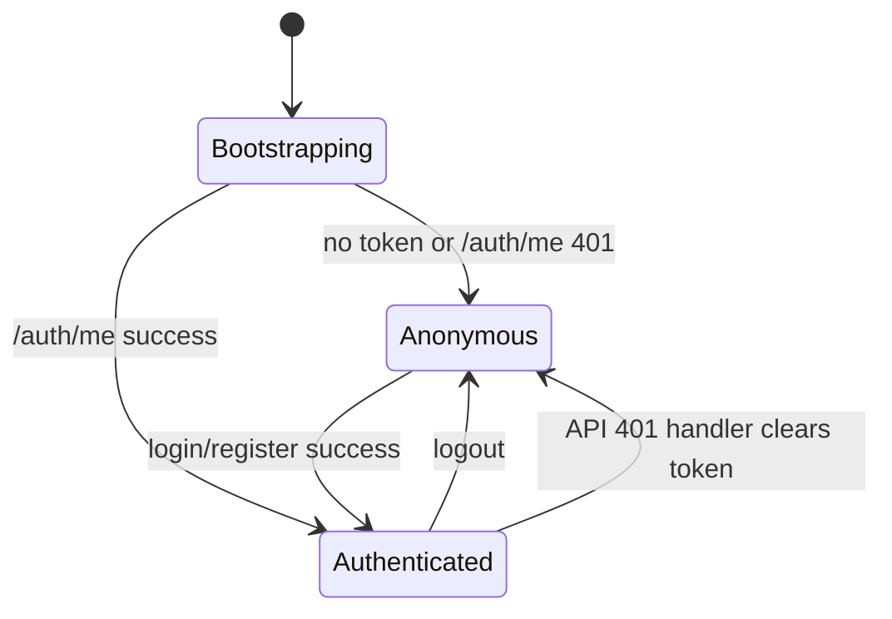

# SecureHub 登录注册认证闭环

## 1. 功能背景与目标

SecureHub / CyberLadder 需要从纯演示态升级为可真实注册、可真实登录、可按用户隔离本地演示数据的最小认证系统。本功能补齐 JWT 登录闭环，同时保留 A3 演示账号用于展示陈同学的课程、画像与工作台数据。

目标范围：

- 用户可使用邮箱、密码、显示名称注册。
- 注册成功后直接签发 JWT 并进入 `/workspace`。
- 已注册用户可登录，刷新后可通过 token 恢复登录态。
- demo 账号可登录并加载原演示数据。
- 新注册用户不自动看到陈同学姓名、邮箱、资产归属或工作台任务。

## 2. 权威边界

- 9 agents 固定：`policy_interpreter`、`hot_analyst`、`job_analyst`、`competition_advisor`、`career_planner`、`topic_explorer`、`doc_archivist`、`task_orchestrator`、`outcome_evaluator`。
- Auth 是基础设施，不算 agent，不进入 LangGraph，不进入 `agent_skills`。
- 不新增画像表，画像仍只走 `user_profiles` 与 `user_capabilities`。
- 注册数据只写入本地运行时数据库，不写入源码、fixture、mockData、JSON 文件或前端代码。
- 不改 RAG、LLM、agent skill、data-layer v2 主线。

## 3. 用户故事

- 新用户注册：用户填写邮箱、显示名称、密码与确认密码；前端校验邮箱格式、密码强度和两次密码一致；后端创建 `users`、空 `user_profiles` 和默认 `user_capabilities`，随后返回 token。
- 新用户登录：用户使用邮箱和密码登录；后端验证 bcrypt hash，返回 JWT；前端保存 token 并进入 redirect 或 `/workspace`。
- demo 账号登录：用户使用 `demo-student@securehub.local / SecureHub@2026` 登录；后端 seed 可重入创建或更新该账号，前端按 demo 用户 id 加载演示数据。
- 退出登录：用户在 Layout 顶部菜单点击退出；前端调用 stateless logout，清除 token，toast 提示并跳转 `/login`。
- 未登录访问工作台：访问 `/workspace`、`/course` 等 Layout 下路由时进入 `/login?redirect=...`，登录成功后回到原目标。

## 4. 后端接口说明

| Method | Path | Request | Response | Error code |
|---|---|---|---|---|
| POST | `/api/v1/auth/register` | `{ email, password, display_name }` | `{ access_token, token_type, expires_at, user }` | `400 PASSWORD_WEAK`, `409 EMAIL_EXISTS`, `422` |
| POST | `/api/v1/auth/login` | `{ email, password }` | `{ access_token, token_type, expires_at, user }` | `401 INVALID_CREDENTIALS`, `403 USER_DISABLED`, `422` |
| GET | `/api/v1/auth/me` | Bearer token | `{ id, email, display_name, is_active }` | `401 AUTH_REQUIRED`, `401 INVALID_TOKEN`, `403 USER_DISABLED` |
| POST | `/api/v1/auth/logout` | none | `{ ok: true }` | none |

## 5. 前端页面与组件结构

- `frontend/src/app/pages/Login.tsx`：登录页。
- `frontend/src/app/pages/Register.tsx`：注册页。
- `features/auth/api.ts`：`login/register/me/logout`。
- `features/auth/types.ts`：认证请求与响应类型。
- `features/auth/store.tsx`：`AuthProvider`、`useAuth`、bootstrap、token storage。
- `features/auth/components/AuthShell.tsx`：认证页布局和产品可信预览区。
- `features/auth/components/AuthForm.tsx`：登录/注册表单。
- `features/auth/components/PasswordField.tsx`：密码显示/隐藏。
- `features/auth/components/PasswordStrength.tsx`：密码强度。
- `features/auth/components/ProtectedRoute.tsx`：工作台路由保护。

## 6. 认证状态流转图

## 7. 数据持久化说明

- JWT 保存位置：默认保存到 `localStorage` 的 `securehub-auth-token`；若用户取消“记住登录”，保存到 `sessionStorage` 的 `securehub-auth-session-token`。
- 用户数据保存位置：运行时数据库，默认本地 SQLite `backend/securehub_dev.db`，也可由 `DATABASE_URL` 指向 Postgres。
- GitHub 边界：运行时数据库、SQLite WAL/SHM、dump 目录和前端构建产物均加入 `.gitignore`，不得提交。

## 8. mock 数据隔离策略

- demo 账号行为：`demo-student@securehub.local` 登录后使用原 Workspace/Profile 演示数据，并将顶部用户区显示为陈同学。
- 新账号行为：首次进入 Workspace 显示空工作台简报；Profile 显示当前账号身份、空资产、空提交清单和基础安全状态。
- localStorage 分区：
  - `workspace-demo:<user_id>`
  - `profile-workspace-demo:<user_id>`
- 已处理关键 feature：Profile、Workspace。
- 后续事项：Chat、Tasks、Writing、Forum、Careers 等 feature 若仍使用全局 mock key，需要继续按 `user.id` 分区。

## 9. 安全说明

- 密码使用 `passlib[bcrypt]` 哈希，数据库不保存明文密码。
- JWT 使用 `python-jose` 签发，`sub` 为 user UUID，包含 `exp`。
- 登录邮箱不存在与密码错误统一返回 `401 INVALID_CREDENTIALS`，不泄露账号是否存在。
- token 过期、格式错误、用户不存在统一返回 401。
- 当前刻意不做刷新 token、OAuth、邮箱验证、短信验证码、刷新 token 黑名单、多租户和复杂 RBAC。

## 10. 测试与验收结果

- `cd backend && uv run pytest`：本机 `uv` 未在 PATH 中，命令无法执行；改用 `backend/.venv/Scripts/python.exe -m pytest` 覆盖同一测试集，结果 `11 passed, 12 skipped`。新增 `tests/test_auth.py` 覆盖注册成功、重复邮箱 409、登录成功、错误密码 401、`/auth/me` 带 token 成功、无 token 401、demo 账号登录。
- `cd frontend && pnpm typecheck`：通过。
- `cd frontend && pnpm build`：通过；Vite 仍提示主 chunk 超过 500 kB，属于构建体积建议，不阻断本功能。
- `docker compose config`：通过。
- Browser/Playwright 验收：`/login` desktop 1440 无水平溢出；`/register` mobile 390 无水平溢出；注册后自动进入 `/workspace`；退出后回到 `/login?redirect=...`；刷新后保持登录态；新注册用户 Workspace/Profile 不显示“陈同学”；demo 账号登录后显示“陈同学”演示资料；浏览器 console 无页面错误。

## 11. 后续建议

- 为 Chat、Tasks、Writing 等剩余 localStorage feature 增加用户分区。
- 增加邮箱验证与密码重置流程。
- 增加刷新 token 与更细粒度的会话管理。
- 在生产环境用强随机 `JWT_SECRET` 覆盖默认开发值。
